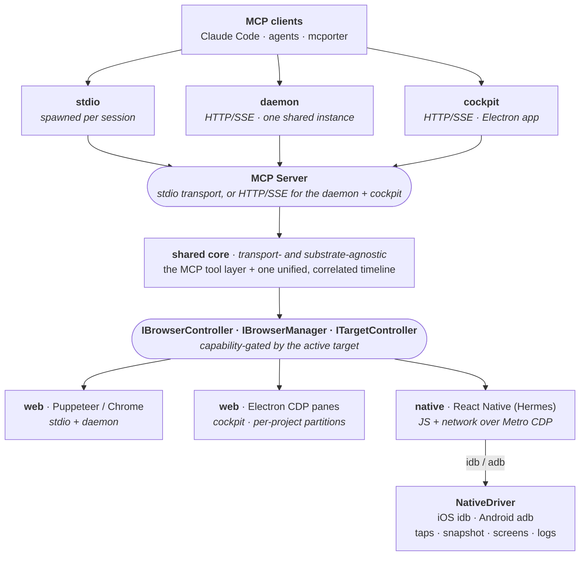

<p align="center">
  
</p>

<p align="center">
  Browser control + dev-server logs on one correlated timeline — for AI agents and humans.
</p>

<p align="center">
  <a href="https://www.npmjs.com/package/devloop-mcp"></a>
  <a href="https://github.com/vincentvella/devloop/actions/workflows/ci.yml"></a>
  <a href="https://glama.ai/mcp/servers/vincentvella/devloop"></a>
  <a href="https://github.com/vincentvella/devloop/blob/main/LICENSE"></a>
  <a href="https://biomejs.dev"></a>
  <a href="https://conventionalcommits.org"></a>
</p>

<p align="center">
  <a href="https://devloop.build"></a>
</p>

---

A unified dev-loop tool: it drives a **browser** and your **dev server**, pushing both sides into one timestamped buffer so you can correlate a browser console error with the backend stack trace from the same moment. It runs two ways from a shared core:

- **Headless (stdio)** — drives Chrome via Puppeteer, served over stdio. The lightweight mode Claude Code spawns per session. Run `devloop-mcp daemon` to instead serve one shared, long-running instance over HTTP/SSE that many agents/sessions connect to (see **Daemon mode**).
- **Cockpit (Electron)** — a single desktop window: tabbed browser panes (embedded `WebContentsView`s driven via CDP) with a browser bar (back/forward/reload + address) beside a collapsible side panel that toggles between **logs** and a **repro builder**. Project picker, auto-navigate, pop-out targets. The renderer is React 19 + Tailwind v4 + Radix + lucide-react. Serves the same tools over HTTP.

Because every event (browser console/network/page-errors **and** server stdout/stderr) shares one monotonic clock, `get_logs_around` / `repro` return a correlated, cross-source slice of the timeline.

### Native targets — Expo / React Native (iOS + Android)

The cockpit also drives **Expo/React Native** projects, not just web. Open a native project and you get one pane with a **Web · iOS · Android** target switcher, a **bundler** toggle (Metro) separate from a **Build** button (`expo run:ios` / `expo run:android`, with `@expo/fingerprint` staleness detection), and:

- **JS console + errors over CDP** via Metro's Hermes inspector (both platforms) — with **source-mapped** stacks (your bundled `index.bundle:1:…` resolves to original `.tsx`).
- **RN network capture** — an injected `XMLHttpRequest` hook turns the app's fetch/XHR traffic into the same `network` timeline rows as web (so `get_network` / `export_har` / the network chip work for native too).
- **Native device logs** merged onto the timeline as a `native` source — iOS `simctl log stream`, Android `logcat`.
- A **live, interactive device embedded in the pane** — iOS via [serve-sim](https://github.com/EvanBacon/serve-sim) (MJPEG, tap/scroll/type), Android via a polled `screencap` mirror (~2fps) with click→tap + key input. Screenshots on both.
- **Agent-drivable interactions** — `browser_snapshot` reads the native accessibility tree (iOS via [idb](https://fbidb.io)'s UIKit a11y tree; Android via `uiautomator dump`) and `browser_click`/`type`/`scroll`/`press` drive the device by an element's `pt:x,y` ref (from the snapshot) or its label — replayable through `repro`, openable over MCP via `native_open` / `native_build`. The same agent tools as web, mapped onto native.

All of it lands on the same correlated timeline, app-scoped — the web dev-loop experience, for a native app. (macOS + Apple Silicon for the embedded iOS simulator; Android works wherever the Android SDK + an emulator do.)

**iOS interactions need [idb](https://fbidb.io):** `brew install facebook/fb/idb-companion` and `pipx install fb-idb` (use Python <3.14 — newer Python breaks fb-idb). **Android interactions need the Android SDK platform-tools** (`adb`) + a booted emulator. The cockpit's **Settings → native readiness** runs a per-platform preflight (iOS: idb · companion · booted sim; Android: adb · booted device) and shows the exact fix for anything missing; observation (logs/screenshots) works without the interaction tooling.

serve-sim is **vendored into the cockpit** and run via Electron's own Node, so the embedded simulator works out of the box — **offline, no `bun`/`node`/`npx` or first-run fetch**. (Running from source uses the copy in `node_modules` instead.)

## Architecture

Three **transports** expose one **shared core**, which drives one of several **substrates** (a real browser, or — in the cockpit — a native device). Everything pushes onto a single timestamped **timeline**.



**The tool layer never knows what's behind it** — Puppeteer or Electron, stdio or HTTP, web page or native app. It's wired once at startup. The browser sits behind a single `IBrowserController` interface; the cockpit's pane manager implements the richer `IBrowserManager` (multiple panes, delegating browser_* to the active one — or to the native controller when an iOS/Android target is open). A capability layer gates tools by the active target, so an agent gets a clear message instead of a substrate error.

stdout is reserved for the MCP protocol in stdio mode; all human-facing output goes to stderr.

### The layers

- **Transports** — three entrypoints over two protocols: **stdio** (one server per session) and **HTTP/SSE** (the long-running **daemon**, and the **cockpit**). All build the same MCP server bound to the tool layer; only the HTTP transports are multi-client (each connecting client gets its own session, one shared backend).
- **Shared core** — the **tool layer** (the MCP tools + a capability-gated dispatcher) over **one unified, correlated timeline** (server output, browser console/network/errors, native logs), backed by a separate full-capture network ring. The cross-cutting features the tools expose — a project registry, error diagnostics, source-map resolution, HAR export, and bug-report bundles — live here too.
- **Browser substrates** — a shared controller interface with two web implementations (**Puppeteer/Chrome** for headless; **Electron `WebContentsView`** panes over CDP in the cockpit) and a native one (**React Native** over Hermes/Metro). Shared page-action + accessibility-snapshot logic and device/throttle emulation sit above them.
- **Native targets** — an RN controller (JS/errors/network over Metro CDP) delegates taps + snapshots to a **`NativeDriver`** (idb on iOS, adb on Android); native logs (simctl / logcat), screenshots + live mirrors, build orchestration (`expo run`), and a readiness preflight round it out.
- **State & isolation** — an on-disk registry (projects / session / panes), per-project session partitions, and Chrome-extension management.
- **Cockpit (Electron)** — the desktop shell: a pane manager (per-project partitions, native routing), the React UI (timeline, browser bar, repro builder, target switch, Android mirror), the vendored serve-sim iOS mirror, the in-store "Add to Devloop" injection, and the in-app updater.

## Install

**Headless MCP (stdio)** — no clone needed, register it with Claude Code:

```sh
claude mcp add devloop --scope user -- npx -y devloop-mcp
```

(Published as [`devloop-mcp`](https://www.npmjs.com/package/devloop-mcp) on npm; Puppeteer fetches Chromium on first install.)

**Cockpit (desktop app)** — grab the installer for your OS from [Releases](https://github.com/vincentvella/devloop/releases) (`.dmg` / `.exe` / `.AppImage`). macOS ships both Apple Silicon (`arm64`) and Intel (`x64`) builds. The app checks GitHub for a newer release on launch and prompts before downloading or installing — or trigger it yourself from **settings → updates → check for updates**.

**From source** (dev) — requires [bun](https://bun.sh):

```sh
bun install
bun run app          # build + launch the Electron cockpit
bun run start        # or run the stdio MCP directly
```

## Use it from your coding agent

Once it's registered, drop this into your **`CLAUDE.md`** (or any agent's rules file) so the agent drives features through Devloop and **verifies them live** instead of reasoning from the code alone:

```md
## Devloop — use it for any web/mobile feature work

When you build, test, or debug a feature that runs in a **browser** or an **Expo /
React Native** app, drive it through **devloop** instead of reasoning from the code
alone. It puts the dev-server logs and the live browser/device on one correlated
timeline, so you can see what actually happened.

- **Start the loop:** `dev_start` (auto-detects the dev command), then
  `browser_navigate` to the page — or `native_open` for an iOS/Android target.
- **Act, then verify — don't assume:** after a change, reproduce it with `repro`
  (a navigate/click/type sequence) and read the result. Never claim a fix works
  without exercising it in the running app.
- **Find/target elements** with `browser_snapshot` (returns clickable `ref`
  selectors) — prefer it over screenshots.
- **When something breaks:** `diagnose` first (groups errors + failed requests),
  then `get_logs_around` a timestamp to line up the browser console error with the
  matching server stack trace from the same moment. `get_network` / `export_har`
  for request detail.
- **Definition of done:** the feature is verified live in devloop — no console or
  page errors, the expected network calls succeeded, the UI reflects the change —
  not just "the code looks right."
- **Setup stays yours:** if a native build needs a toolchain that isn't installed,
  devloop tells you exactly what's missing and the command to fix it — it
  **diagnoses, it never installs or touches your toolchain.** Run the fix, then rebuild.

Register once: `claude mcp add devloop --scope user -- npx -y devloop-mcp`
```

## Tools (46)

**Dev server** — runtime, no per-project registration needed
- `dev_start({ project?, cmd?, cwd? })` — start a dev server and tee its logs. Specify it three ways: a saved registry `project`; explicit `cmd`+`cwd`; or neither (`cwd` defaults to the server's dir, `cmd` auto-detected from `package.json` scripts: `dev`/`develop`/`web`/`start`/`serve`).
- `dev_stop()` — stop it. Kills the whole **process group** (so `next dev`/`metro` grandchildren die too).
- `dev_status()` — running?, plus cmd/cwd/pid.

**Native targets** — Expo/React Native (cockpit only; needs Electron + a simulator/emulator)
- `native_open({ platform })` — open the iOS simulator or Android device mirror for the active pane; `browser_*` then drive the native app (idb/adb) and JS + native logs stream to the timeline. Returns `ok:false` with a reason if the device/tooling isn't ready.
- `native_close()` — back to the pane's web content.
- `native_build({ platform, cwd? })` — `expo run:ios` / `expo run:android`, streamed to the timeline (`cwd` defaults to the active pane's project). Android returns a toolchain checklist instead of building if the SDK/JDK isn't set up.
- `native_doctor()` — re-check native readiness **without** building or opening: iOS + Android interactions + the Android build toolchain, each a ✓/✗ checklist with the fix for anything missing. Run it after installing a missing tool to confirm it's resolved.
- In headless stdio/daemon mode these report that the cockpit is required (Puppeteer is web-only).

**Browser control** — act on the active pane
- `browser_navigate({ url })`
- `browser_back()` · `browser_forward()` · `browser_reload({ hard? })` — history nav + reload (the browser bar's ←/→/⟲; `hard` ignores cache).
- `browser_screenshot({ fullPage? })` → PNG image
- `browser_click({ selector })`
- `browser_type({ selector, text })`
- `browser_hover({ selector })` · `browser_scroll({ selector? | x?, y? })` · `browser_select({ selector, value })` · `browser_press({ key, selector? })` — keys like `Enter`/`Escape`/`Tab`/`ArrowDown`.
- `browser_wait_for_idle({ idleMs?, timeoutMs? })` — wait until network settles.
- `browser_clear_storage({ allOrigins? })` — clear cookies / localStorage / IndexedDB / cache / service workers for the current origin (or the whole session) — log out / test a fresh user.
- `browser_emulate({ device? | width?, height?, mobile?, deviceScaleFactor?, userAgent?, reset? })` — emulate a device/viewport (`device`: `iphone`/`ipad`/`pixel`, or custom; `reset` → desktop).
- `browser_throttle({ profile })` — network conditions: `slow-3g` / `fast-3g` / `offline` / `none`.
- `browser_eval({ expression })` — runs in page context (not blocked by CSP)
- `browser_snapshot()` — structured page snapshot: url, title, and interactive/landmark elements (role, accessible name, value/state, heading level) each with a CSS selector `ref` usable by `browser_click`/`browser_type`. **Prefer this over a screenshot** to find/target elements reliably.
- `browser_wait_for({ selector?, text?, timeoutMs? })` — wait until a selector appears or text is present (after a navigation/async render). Returns `{ ok, waitedMs }`.

**Logs & correlation**
- `get_logs({ source?, stream?, grep?, app?, sinceSeq?, limit? })` — unified tail. `source` is `server`|`browser`; `stream` is `stdout`/`stderr`/`console`/`network`/`pageerror`. `app` scopes to one project's logs — it matches a pane's **label** (project name) or id (see `pane_list`) and filters *both* that pane's server and browser logs, regardless of which pane is active. Pass the last `seq` as `sinceSeq` to tail incrementally.
- `get_logs_around({ ts, windowMs?, source?, app? })` — **the correlation tool**: all events within ±`windowMs` of a timestamp, time-ordered across both sources (optionally scoped to one `app`).
- The **timeline** shows network events that are failures or status ≥ `DEVLOOP_NET_THRESHOLD` (set it to `0` to surface everything inline), carrying rich `detail` on **all substrates** (Puppeteer / CDP / React Native): method, status, resource type, mime, duration, request + response **headers**, and capped request/response **bodies**.
- `get_network({ grep?, app?, limit? })` — every request from the **full capture ring**, independent of the threshold (vs `get_logs`, which shows only the curated timeline). Use it when a fast 200 you care about isn't on the timeline.
- `export_har({ app? })` — export the full network ring as a **HAR 1.2** document (import into Chrome DevTools / Charles); complete regardless of the threshold. Scope to one `app` if you like.
- `diagnose({ windowMs?, app? })` — **triage what's broken right now**: groups/dedupes repeated errors (console / page / server) with counts, lists failed/4xx-5xx network requests, and returns a one-line summary. Start here before digging through `get_logs`.
- **Page errors carry a `resolvedStack`** — minified browser stack traces are mapped back to original source via the bundle's source map (the browser only de-minifies in its DevTools UI; `error.stack` stays compiled, so we resolve it for you). On the entry's `detail`.
- `export_bundle({ app?, windowMs? })` — a shareable **bug-report bundle** (JSON): diagnose summary + timeline + screenshots + HAR + repro. The cockpit's **report** button saves it as a self-contained HTML page.
- `clear_logs()` — reset before reproducing an issue.
- `repro({ actions | action, waitFor?, settleMs?, stepSettleMs?, idleMs?, timeoutMs?, continueOnError?, clear? })` — **reproduce-and-correlate**: clears the buffer, performs one action or a **sequence**, waits, and returns everything that happened on both sides across the sequence — with per-step results (`steps[]`), a `byStream` count, and a pre-filtered `errors` list.
  - `actions: [{kind, ...}]` — kinds: `navigate`/`click`/`type`/`hover`/`scroll`/`select`/`press`/`eval`/`wait`/`none`. `action` (singular) = one-step convenience.
  - Waits `stepSettleMs` (default 300) between steps, `settleMs` (default 1000) after the last. `waitFor: "networkidle"` waits until no network activity for `idleMs` (default 500) up to `timeoutMs` (default 10000) — **use it for slow/streaming responses** (Expo's first web bundle takes ~12s). On timeout you still get what landed, with a `waitNote`.
  - `continueOnError` (default false) — otherwise stops at the failing step (`stoppedAtStep`).

**Project registry** — saved projects, persisted to `~/.devloop/projects.json`
- `project_list()` — list saved projects (name, cwd, cmd, url, steps).
- `project_add({ name, cwd, cmd?, url?, steps? })` — save/replace a project (incl. a saved repro `steps` sequence), so you can `dev_start({ project })` by name.
- `project_remove({ name })`.

**Panes** — multi-target (cockpit only; stdio mode is single-pane and reports so)
- `pane_list()` — each pane: `{ id, url, active, popped }`. The active pane is what `browser_*`/`repro` target; events are tagged with their pane `id`.
- `pane_new({ url? })` — open a new pane and make it active.
- `pane_select({ id })` — make a pane active.
- `pane_close({ id })`.
- `pane_pop({ id })` — detach a pane into its own standalone window (side-by-side targets).
- `pane_set_label({ id, label })` — rename a pane (same as double-clicking the tab).

**Extensions** — Chrome extension management (cockpit only)
- `ext_list()` — installed extensions: `{ id, name, version, enabled }`.
- `ext_install({ idOrUrl })` — install by Chrome Web Store id/URL.
- `ext_remove({ id })` — uninstall.
- `ext_set_enabled({ id, enabled })` — enable/disable without uninstalling.

### Console arguments

`console.log(obj)` is captured with arguments resolved to real values (e.g. `[log] user {"id":7}`), not `JSHandle@object`. The Electron substrate renders them synchronously from CDP previews; the Puppeteer substrate uses a *reserve-then-fill* pattern (stamp `seq`/`ts` synchronously at arrival, patch resolved args in afterward) so ordering matches emit order and interleaves correctly with server logs.

## Headless mode (stdio)

Register **once**, at user scope — works for every project:

```sh
claude mcp add devloop --scope user -- npx -y devloop-mcp
```

Then, in any project: *"dev_start and repro a navigate to /projects"*. `dev_start` defaults `cwd` to the project you're in and auto-detects the command.

| Var | Default | Meaning |
| --- | --- | --- |
| `DEVLOOP_HEADLESS` | `false` | `"true"` runs Chrome headless; default headful so you can watch. |
| `DEVLOOP_CHROME_PATH` | _(bundled)_ | Explicit Chrome executable path. |
| `DEVLOOP_NET_THRESHOLD` | `400` | Log network responses with status >= this (failures always logged). |
| `DEVLOOP_ACTION_TIMEOUT` | `10000` | Cap (ms) on interactions — a wedged page fails fast instead of hanging. |
| `DEVLOOP_NAV_TIMEOUT` | `30000` | Cap (ms) on navigations. |
| `DEVLOOP_LOG_CAPACITY` | `5000` | Max buffered events. |
| `DEVLOOP_NET_RING` | `3000` | Max requests held in the full-capture network ring (`get_network` / `export_har`), independent of `DEVLOOP_NET_THRESHOLD`. |
| `DEVLOOP_DEV_CMD` / `DEVLOOP_DEV_CWD` | _(none)_ | Optional dev-server auto-start on boot (normally use `dev_start`). |
| `DEVLOOP_HOME` | `~/.devloop` | Registry location. |

## Daemon mode (shared HTTP/SSE)

Instead of every agent/session spawning its own stdio server (its own browser + timeline), run **one long-running daemon** they all connect to over HTTP/SSE — many clients, one Devloop instance (one browser, one dev server, one correlated timeline):

```sh
devloop-mcp daemon                 # headless; serves MCP at http://localhost:7333/mcp
# then point any number of MCP clients at it:
claude mcp add --transport http devloop http://localhost:7333/mcp
```

Same backend + env vars as stdio (defaults headless; set `DEVLOOP_HEADLESS=false` to watch), and it auto-picks a free port from `DEVLOOP_HTTP_PORT` (default 7333). Each client gets its own MCP session but shares the same backend, so one agent's `dev_start` / navigation shows up on another's `get_logs`. (The Electron cockpit serves the very same HTTP transport — the daemon is just the headless version of it.)

Manage the daemon's lifecycle:

```sh
devloop-mcp daemon --status        # is one running? (pid + url)
devloop-mcp daemon --stop          # SIGTERM the running daemon
DEVLOOP_DAEMON_IDLE_MS=60000 devloop-mcp daemon   # auto-exit 60s after the last client disconnects
```

### Shared mode — auto-connect from stdio (no separate daemon step)

Don't want to manage a daemon by hand? Launch the **stdio** server in shared mode and it will **bridge to a daemon automatically** — connecting to a running one, or spawning + detaching one if none exists — instead of starting its own browser. So every session transparently shares one browser/timeline:

```sh
claude mcp add devloop --scope user -- npx -y devloop-mcp --shared
# or set DEVLOOP_DAEMON=1 in the MCP server env
```

The stdio process becomes a thin proxy (it speaks stdio to the client, forwarding tools to the daemon over HTTP). The daemon advertises itself in `$DEVLOOP_HOME/daemon.json` so other sessions find it. If anything goes wrong (daemon won't start, etc.) it **falls back to a normal local instance**, so a session never just dies. Without `--shared` / `DEVLOOP_DAEMON=1`, behavior is unchanged: one browser per session.

## When MCP is blocked (enterprise sandbox) — drive Devloop via [mcporter](https://mcporter.sh)

Some sandboxed/enterprise setups don't let an agent register or spawn MCP servers (or block the MCP transport) but **do** allow running shell commands. [`mcporter`](https://www.npmjs.com/package/mcporter) bridges that gap: it calls any MCP server's tools as plain CLI commands, so the agent invokes Devloop through **Bash** instead of an MCP client.

The robust pattern is **daemon + mcporter over HTTP** — run one Devloop daemon (once, outside or alongside the sandbox), then call its tools as shell commands:

```sh
devloop-mcp daemon                                          # one shared instance on :7333

# point mcporter at it ad-hoc (no config); --allow-http since it's localhost cleartext
npx mcporter list  --allow-http --http-url http://localhost:7333/mcp --name devloop
npx mcporter call  --allow-http --http-url http://localhost:7333/mcp 'devloop.dev_start(cwd: "/repo")'
npx mcporter call  --allow-http --http-url http://localhost:7333/mcp 'devloop.browser_navigate(url: "http://localhost:3000")'
npx mcporter call  --allow-http --http-url http://localhost:7333/mcp 'devloop.diagnose()'
```

Or skip the daemon and let mcporter spawn the stdio server per call (if process spawning is allowed):

```sh
npx mcporter list --stdio "npx devloop-mcp" --name devloop
npx mcporter call --stdio "npx devloop-mcp" 'devloop.get_logs(limit: 50)'
```

Notes:
- **Persist it** so you don't repeat the descriptor: add Devloop to `~/.mcporter/mcporter.json` (or pass `--persist`). mcporter also **auto-imports** servers already configured in Claude Code/Desktop, Cursor, Codex, etc. — so a prior `claude mcp add devloop …` is picked up automatically, and you can just `npx mcporter call devloop.<tool> …`.
- `npx mcporter list devloop --schema` prints every tool with TypeScript-style signatures — handy for the agent to discover args.
- For a fully self-contained CLI, `npx mcporter generate-cli devloop` emits a standalone binary; `mcporter serve` re-exposes servers as one bridged endpoint. See the [mcporter docs](https://mcporter.sh).

(Exact ad-hoc flags can vary by mcporter version — `npx mcporter --help` is authoritative.)

**Agent skill:** [`skills/devloop/SKILL.md`](skills/devloop/SKILL.md) packages this as an installable [Agent Skill](https://docs.claude.com/en/docs/claude-code/skills) — drop it in (`cp -r skills/devloop ~/.claude/skills/`, or into a project's `.claude/skills/`) and the agent knows to drive Devloop over mcporter when MCP is blocked, with the daemon setup + tool recipes built in.

## Cockpit mode (Electron)

```sh
bun run app          # build + launch the cockpit
bun run app:selftest # headless integration test (no visible windows)
```

**One window** (React 19 + Tailwind v4 with `@theme` tokens + Radix `Dialog`/`Tooltip` + lucide-react icons), laid out as:
- **Top bar** — the **pane tabs**, then the active pane's **dev controls** + window toggles:
  - **dev controls** (act on the active pane): a status chip (`● project` green when running, `✗ exited (code N)` red on a non-zero exit, else `dev: stopped`/`not configured`), **▶/⏹** start-stop the dev server, **⟳** restart it (Power), **📷** screenshot the pane into the timeline.
  - `⚙` settings · `⤢` pop out the active pane into its own window.
  - Tabs are auto-named from the project (`package.json` `name`, else folder basename), carry a **green running dot** when that pane's server is up, show `⤢` when popped; **click** to switch (the timeline follows the active pane), **double-click** to rename, `×` to close, `+ pane` to add. Live-updates whether panes change from the UI or from Claude.
- **Browser bar** (above the pane) — **←/→** back/forward (disabled when there's no history), **⟲** reload, **⤓** hard-reload (ignore cache), **⌫ clear site data** (cookies/localStorage + reload), and an **address bar** showing the active pane's live URL — it follows link clicks / SPA route changes (the manager listens to `did-navigate`); accepts a bare port (`3000` → `http://localhost:3000`) or any `http(s)://` URL; Enter navigates (`⌘L` focuses).
- **Browser area** — the active pane: a real Chromium `WebContentsView` driven via CDP. Other panes keep running in the background (their logs keep flowing); the active one is positioned over this region and reflows when you collapse panels or resize.
- **Settings** (behind `⚙`, collapsed by default so the top bar stays clean) — labeled rows:
  - **project** — dropdown of saved projects; **picking one opens it immediately** (fills cmd/cwd/url + repro steps, then dev-starts + navigates). **💾 save** snapshots the active pane as a project named by its tab label (rename on the tab).
  - **dev** — `cmd` (blank = auto-detect) + **📁 folder** picker + `cwd`. **Auto-saved to the active pane on blur** (and on folder pick) — no separate "apply" button; after that the top-bar **▶** is pre-wired.
  - **ext** — load Chrome extensions into the panes (React/Redux DevTools, or your own under dev): install by **Chrome Web Store id/URL**, or **📁 load an unpacked** folder. Extensions persist and reload on launch, and live in the panes' session (isolated from the cockpit UI). Powered by `electron-chrome-web-store`; Electron's extension API is partial (MV3 mostly works; some `chrome.*` gaps).
- **Side panel** (collapsible) — a segmented **logs / repro** control:
  - **logs** — the live event list (per-source coloring, timestamps, pane tags, click-to-expand long rows, screenshot thumbnails → Radix-`Dialog` lightbox). **Network rows** are status-tier colored (2xx/3xx/4xx/5xx) and expand to show method/status/duration + request/response **headers and bodies**. Sticky filter bar: substring filter + chips (`server`/`console`/`network`/`errors`/`repro`), a `↓ latest` pill, **HAR** export, and `clear`. **Always scoped to the active pane.**
  - **repro** — the **repro builder** (`+ step` / `pick` / `run`); **pick** lets you click an element in the page to capture a stable selector straight into a click step; results land in the **logs** timeline (it auto-switches there) with per-step ✓/✗ and the correlated error list.
  - Collapse via the `›` in the panel header; re-expand via a small **hover handle** on the right edge. Popping the active pane into its own window **fills the freed space with the timeline**. Drag the divider to resize.
- **Pop-out window** — `⤢` (right of the URL bar) detaches the active pane into its **own browser window with its own bar** (back/forward/reload/hard-reload/address/screenshot), driving that pane by id; the live URL tracks navigations and `⌘R` reloads the page. Closing it re-docks the pane.
- **Keyboard:** `⌘L` address bar · `⌘R`/`⌘⇧R` reload/hard-reload · `⌘K` clear · `⌘B` toggle panel · `⌘,` settings · `⌘1–9` switch panes.

**Per-pane projects:** each pane has its own dev server and config (cmd/cwd) — so different panes run different projects (on different ports) at once, and the controls act on whichever pane is active.

**Auto-navigate:** on dev-start (or opening a project), the cockpit watches that pane's server output and opens the first `http://localhost:PORT` it announces in the pane — no port-typing.

**Persistence & restore:** open panes (each pane's URL, project label, and dev config) are saved to `~/.devloop/panes.json` and restored on relaunch; the form state (repro steps + selected project) is saved to `~/.devloop/session.json`. Restore **does not assume a dev server is running** — a pane whose saved URL is a dev (`localhost`) URL comes back as a "press ▶ to start" placeholder (its real URL preserved), and hitting **▶** starts the server and auto-navigates.

The cockpit serves the same tools over **MCP-over-HTTP** (stateful sessions). It auto-picks a free port starting at `DEVLOOP_HTTP_PORT` (default 7333) and logs the URL. Point Claude at the running cockpit:

```sh
claude mcp add --transport http devloop-cockpit http://localhost:7333/mcp
```
(Only connected while `bun run app` is running.)

**Clean teardown:** closing the window (or quit / SIGTERM / SIGINT) tears down everything — the dev-server process group, all browser panes, and the HTTP server — with a hard-exit fallback if graceful quit stalls. And the dev server runs under a **parent-pid watchdog**, so even a crash/SIGKILL of the cockpit can't orphan it (no `next dev` left holding `:3000`).

Cockpit-only env: `DEVLOOP_HTTP_PORT` (default 7333), plus the shared `DEVLOOP_NET_THRESHOLD` / `DEVLOOP_ACTION_TIMEOUT` / `DEVLOOP_LOG_CAPACITY` / `DEVLOOP_HOME`.

## Project layout

```
src/
  logBuffer.ts          source-aware, timestamped ring buffer (+ live onPush)
  devServer.ts          runtime dev-server manager (process-group kill) + detectDevCommand
  registry.ts           persisted project registry
  browserController.ts  IBrowserController + IBrowserManager interfaces
  browser.ts            PuppeteerBrowserController (headless/stdio)
  electronBrowser.ts    ElectronBrowserController (cockpit; CDP debugger)
  toolLayer.ts          TOOLS + handleTool, bound via configureTools(deps)
  index.ts              stdio entry (Puppeteer + stdio)
cockpit/
  main.ts               Electron main: windows, BrowserManager, MCP-over-HTTP, lifecycle
  browserManager.ts     multi-pane manager (IBrowserManager)
  preload.ts            contextBridge IPC surface
  renderer/             React UI — main.tsx (app) + global.d.ts (IPC types) +
                        styles.css (Tailwind v4 @theme) + index.html
  build.ts              Bun build for main/preload/renderer + Tailwind CLI step
```

## Test & checks

CI gates every push and PR — **lint/format**, **types**, **unit**, **smoke**, **daemon**, **mcporter CLI**, the **cockpit selftest**, and the **GUI** end-to-end. Run the whole gate locally with `bun run test:all`, or piece by piece:

```sh
bun run check           # Biome lint + format check (the CI gate; `bun run format` to auto-fix)
bun run typecheck       # tsc across core + renderer + gui
bun test                # unit tests (pure logic)
bun run test-smoke.ts   # headless Puppeteer: structured args, networkidle, repro sequence, abort
bun run test:daemon     # HTTP/SSE daemon: two clients sharing one backend
bun run test:mcporter   # the mcporter CLI path: `mcporter call devloop.<tool>` over HTTP
bun run app:selftest    # headless Electron: substrate→buffer, tool layer, MCP-over-HTTP,
                        # renderer IPC, registry, multi-target panes + pop-out, auto-navigate,
                        # derived project name, per-pane dev (server-log tagging), app-scoped
                        # get_logs, inline repro builder, pane persistence/restore, teardown
bun run mcp-drive.ts    # live smoke test: drives a RUNNING cockpit over its MCP-over-HTTP
                        # endpoint (start dev server → auto-navigate → verify the live app via
                        # browser_eval → app-scoped get_logs → screenshot). Cockpit must be up.
```

New features are built **test-first** against this harness. Code is linted + formatted with [Biome](https://biomejs.dev) (`bun run check` / `bun run format`), and commits follow [Conventional Commits](https://www.conventionalcommits.org). See **[CONTRIBUTING.md](CONTRIBUTING.md)** for the full workflow, and **[SECURITY.md](SECURITY.md)** to report a vulnerability. Release history lives in **[CHANGELOG.md](CHANGELOG.md)**.

## Gotchas learned in the field

- **Port conflicts surface as browser 500s.** Wiring against an Expo app while another held port 8081 produced a browser-side `500`; the *server* logs showed Expo had skipped starting. Pin a free port per app — and a good example of why the unified timeline helps.
- **`bun run dev` spawns the real server as a grandchild.** Killing the shell orphans `next dev`/`metro`; that's why the dev server is spawned detached and stopped by process group.
- **Don't pass `CI=1` for interactive use** — it disables Metro watch/HMR.

## Where to take it next

- **EAS Build fallback** — an `eas build` path for native builds when there's no local toolchain (Android especially), surfaced in the **Settings → native readiness** preflight.
- **Configurable snapshot depth** — let `browser_snapshot` override the 250-element cap for dense UIs (data tables, long forms).

_Done: unified browser+server timeline · `get_logs_around` correlation · `repro` one-shot + action sequences (results rendered inline) · `waitFor: networkidle` · structured console args · bounded interaction timeouts · self-healing re-acquire (Puppeteer **and** Electron panes — recover from renderer crash) · **network request/response bodies** (capped, base64-decoded, on logged Electron entries) · project registry (with saved repro steps) · session persistence · single-window Electron cockpit — tabbed panes, collapsible toolbar + timeline, pop-out, project-named tabs · per-pane dev servers, configure-once (auto-saved) · auto-navigate from logs · pane persistence + restore (no "assume running") · **React 19 + Tailwind v4 + Radix + lucide-react** renderer · browser bar (back/forward/reload + live address) · segmented logs/repro panel · **pop-out windows with their own browser chrome** · screenshot → timeline (thumbnail + lightbox) · dev failed-state indicator · project picker (open-on-pick) + folder browse · visual repro builder · MCP-over-HTTP · clean process-group teardown + crash watchdog · Electron security-warning suppression · **native targets (Expo / React Native iOS)** — Web·iOS switcher, separate bundler/build (`expo run:ios` with `@expo/fingerprint` staleness), source-mapped Hermes JS logs over CDP, `simctl` native device logs on the timeline, and a **vendored, offline live interactive iOS simulator** embedded in the pane · **agent-driven native interactions** — `browser_snapshot` of the UIKit a11y tree + `browser_click`/`type`/`scroll`/`press` via idb (by `pt:x,y` ref or label), replayable through `repro`, with a **Settings → native readiness** preflight · per-pane Chrome extension load/toggle + an in-store **"Add to Devloop"** install button · **in-app update banner** (download progress + restart) · **Android target** (Web·iOS·Android switch, adb-driven snapshot/tap via `uiautomator`, `logcat` on the timeline, a live `screencap` mirror, `expo run:android`) · **RN network capture** (injected XHR hook → `network` rows) · **full network-capture ring** (complete HAR + `get_network`, threshold-independent) · **viewport/throttle picker** UI · **per-project session partitions** (same-origin isolation) · **shared HTTP/SSE daemon** (`devloop-mcp daemon` — many agents, one instance) · **native open/build over MCP** (`native_open`/`native_close`/`native_build`) · **shared-mode stdio auto-connect** (the stdio entry bridges to a running daemon — or spawns one — and falls back to a local instance) · **full MCP parity** (extension management `ext_*`, `browser_back`/`forward`/`reload`, `pane_set_label`)._
